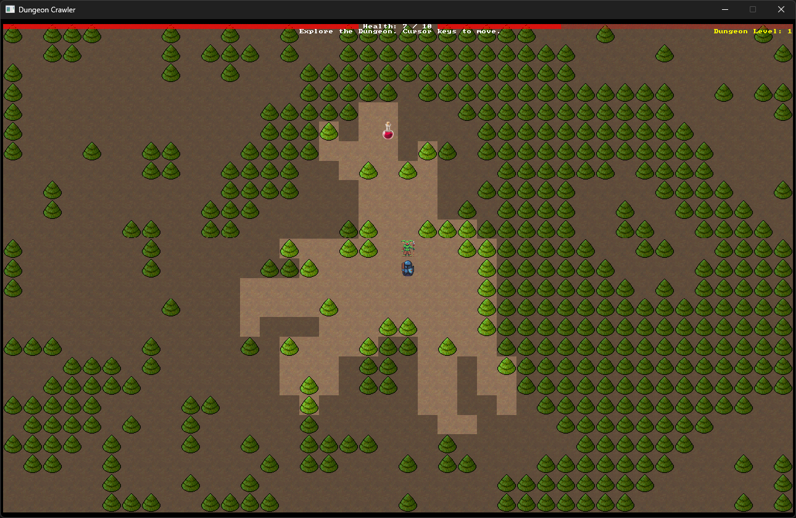
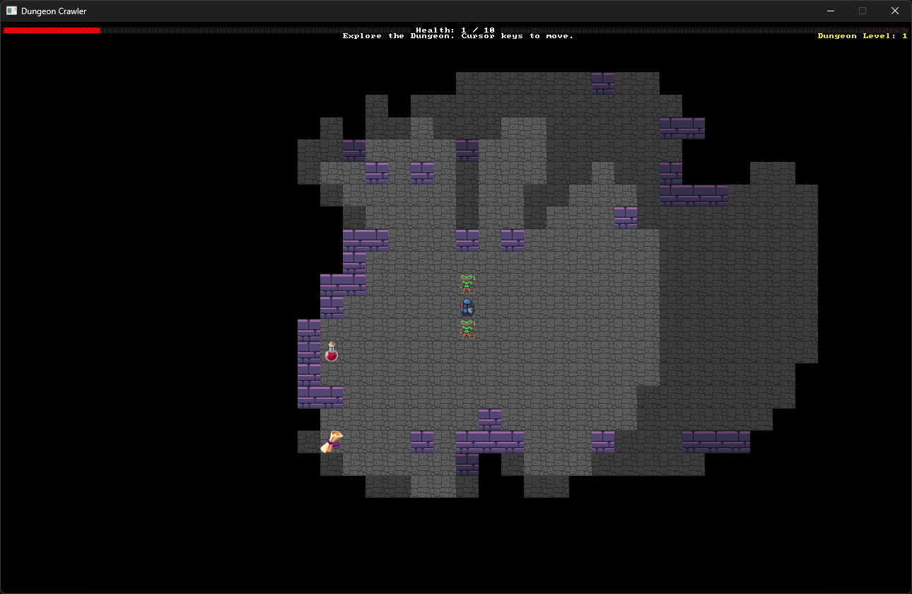

# dungeon_crawler

A 2D Dungeon Crawler game created in Rust to study folowing the Hands-on Rust book. 📖

Explore the dungeons levels, kill the enemies and find the "Amulet of Yala". 📿

## ⚙️ Tools

- 👾 **bracket-lib** - Roguelike game tollkit
- 🧩 **legion** - High performance entity component librady

## 🚀 Getting started

Make sure that you have Rust installed; 
Clone the repository in your machine; 
Open the repository with your terminal and run the following command:

1. `cargo run`;

The game will automatically open on your computer; 
Have fun!! 🔥

---

Made with ♥ by Vilson Castilho
